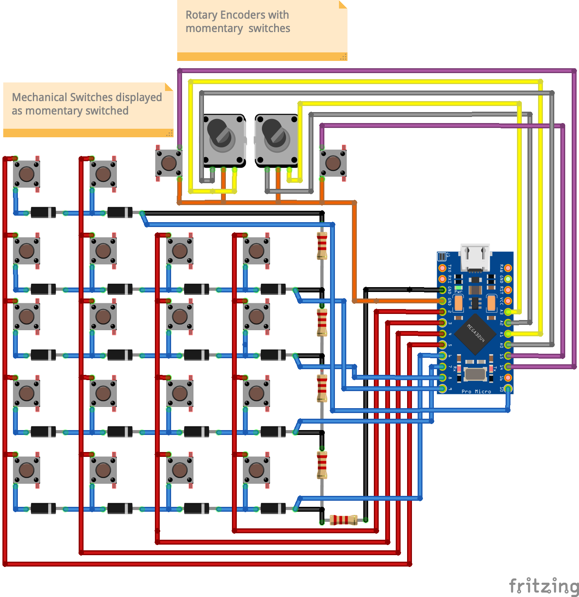
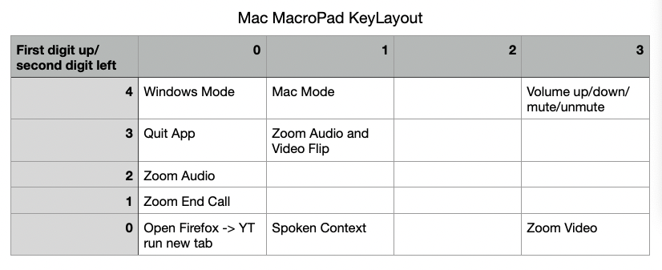

# MacroPad ReadMe
MacroPad was made with mechanical switches, rotary encoders, and an arduino pro micro. The case was design and printed based on my own designs and specs.

## Wiring Diagram

## Mac Key Map

## Windows Key Map
- Not in use
